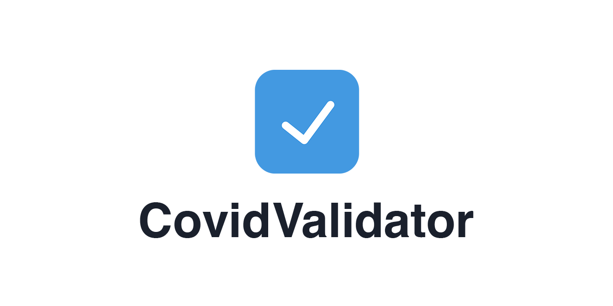

<div align="center">

 [](https://github.com/timokoenig/covid-validator/issues) 

</div>

A desktop application wrapper for [CovidValidator.app](https://covidvalidator.app)

Check EU Digitial Covid Certificates with ease and validate them against local or country rules.

[CovidValidator Project](https://github.com/timokoenig/covid-validator)

!IMPORTANT: This is an experimental project and not for production use, yet.

## Getting Started

```sh
npm install
npm run dev
```

## Build MacOS app

```sh
npm run build
```

---

<p align="center">Made with <span style="color: red">♥</span> for the community</p>